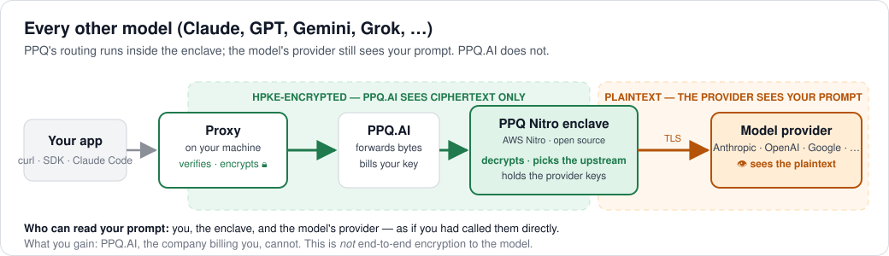
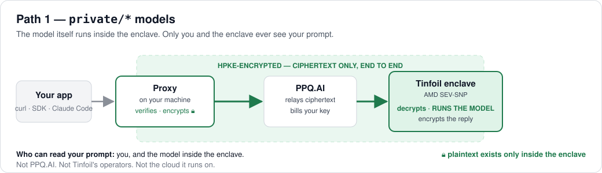

# ppq-private-mode

**Use PPQ.AI models without PPQ.AI reading your prompts.**

This is a small proxy that runs on your machine. Point any OpenAI- or
Anthropic-compatible client at it and it does two things before a request
leaves your computer:

1. **Verifies** the hardware enclave the request is headed for, by checking the
   enclave's attestation against published code measurements.
2. **Encrypts** the request to a key that only that enclave holds.

Which enclave depends on the model you ask for:

| You ask for | Your request is encrypted to | Who can read your prompt |
|---|---|---|
| **Any frontier model**: Claude, GPT, Gemini, Grok, … | **PPQ's AWS Nitro enclave**, which forwards it to the model's provider | The model's provider (Anthropic, OpenAI, …). **Not PPQ.** |
| **A `private/*` model**: Kimi K3, GLM-5.3, DeepSeek, … | **Tinfoil's enclave**, where the model itself runs | **Nobody but you.** Not PPQ, not Tinfoil. |

Either way, PPQ only ever handles ciphertext. You don't need any crypto in your
own code.

## Quick start

You need Node.js 20+ and a PPQ.AI API key from [ppq.ai/api-docs](https://ppq.ai/api-docs).

```bash
PPQ_API_KEY=sk-your-key npx ppq-private-mode
```

The proxy starts on `http://127.0.0.1:8787` once it has verified the enclaves.
Then send requests to it in the usual OpenAI format:

```bash
# A frontier model, encrypted to PPQ's Nitro enclave
curl http://127.0.0.1:8787/v1/chat/completions \
  -H "Content-Type: application/json" \
  -d '{"model":"anthropic/claude-sonnet-5","messages":[{"role":"user","content":"Hello"}]}'

# A private model, encrypted to Tinfoil's enclave
curl http://127.0.0.1:8787/v1/chat/completions \
  -H "Content-Type: application/json" \
  -d '{"model":"private/kimi-k3","messages":[{"role":"user","content":"Hello"}]}'
```

Or with an SDK:

```js
import OpenAI from "openai";

const client = new OpenAI({ baseURL: "http://127.0.0.1:8787/v1", apiKey: "unused" });

const response = await client.chat.completions.create({
  model: "openai/gpt-5.3",          // or "private/glm-5-3", …
  messages: [{ role: "user", content: "Hello" }],
});
```

Requests are billed to `PPQ_API_KEY`. To bill a different key, send it as
`Authorization: Bearer sk-…` and the proxy uses that one for the request.

Open `http://127.0.0.1:8787` in a browser to see the proxy's status page.

### Claude Code

The proxy also accepts the Anthropic Messages format (`POST /v1/messages`,
including streaming and tool calls), so Claude Code works through it
unchanged:

```bash
PPQ_API_KEY=sk-your-key npx ppq-private-mode     # terminal 1

export ANTHROPIC_BASE_URL="http://127.0.0.1:8787"  # terminal 2
export ANTHROPIC_AUTH_TOKEN="sk-your-key"
export ANTHROPIC_MODEL="anthropic/claude-opus-5"   # or private/glm-5-3
export ANTHROPIC_SMALL_FAST_MODEL="private/glm-5-3-flash"
claude
```

For a fully private session with a `private/*` model, use one that handles
tool calls well: `glm-5-3`, `glm-5-3-flash`, `gpt-oss-120b`, `llama3-3-70b` or
`kimi-k3`.

## How it works

Both kinds of request are handled the same way on your machine. The proxy
checks the destination enclave's attestation, then seals the request body
with [EHBP](https://github.com/tinfoilsh/encrypted-http-body-protocol)
(HPKE encryption) to the key that attestation vouches for. The difference is
where the request is decrypted.

### Frontier models → PPQ's Nitro enclave



Frontier models like Claude and GPT can't run inside an enclave, so PPQ runs
its *routing* inside one instead. Your request is encrypted to
`enclave.ppq.ai` and is decrypted only inside that enclave, which then sends it
to the model's provider over TLS.

- **Who can read your prompt:** the model's provider. PPQ's servers, databases
  and logs outside the enclave cannot.
- **What the proxy checks:** AWS Nitro's attestation, against the `PCR0`
  measurement published in
  [ppq-enclave-proxy](https://github.com/PayPerQ/ppq-enclave-proxy/blob/main/attestation/published-pcr.json).
  The enclave's code is public and its build is reproducible, so anyone can
  confirm what it runs. The proxy fetches the published value each time it
  starts.

### `private/*` models → Tinfoil's enclave



Open-weight models run inside [Tinfoil](https://tinfoil.sh)'s confidential
computing enclaves. Your request is encrypted to the enclave that runs the
model. It travels through PPQ's API, which bills your key and passes the
ciphertext on, but it is decrypted only inside Tinfoil's enclave.

- **Who can read your prompt:** nobody but you and the model. Not PPQ, not
  Tinfoil's operators, not the cloud provider.
- **What the proxy checks:** Tinfoil's hardware attestation, against the code
  measurement in Tinfoil's signed release.

### What PPQ can still see

On both paths PPQ sees metadata, because that is how billing works: which API
key made a request, when, for which model, and how many tokens it used.

### If verification fails

The proxy won't send anything to an enclave that hasn't passed verification.

- If Tinfoil's enclave fails verification, the proxy does not start.
- If PPQ's Nitro enclave fails verification, the proxy still starts, but
  requests for frontier models return an error until you restart it.
  `private/*` models are unaffected.

## Models

- **`private/*`:** `kimi-k3`, `gpt-oss-120b`, `llama3-3-70b`, `glm-5-3`,
  `glm-5-3-flash`, `gemma4-31b`, `deepseek-v4-flash`, `deepseek-v4-1-flash`.
  `GET /v1/models` lists these. The `private/` prefix is optional, and a
  request with no model uses `private/kimi-k3`.
- **Everything else:** any model id from [ppq.ai/models](https://ppq.ai/models),
  passed to the Nitro enclave as written. These aren't listed in
  `GET /v1/models` yet.

## Configuration

| Variable | Default | Description |
|---|---|---|
| `PPQ_API_KEY` | — | Your PPQ.AI API key. Required unless `PPQ_DATA_DIR` is set |
| `PPQ_DATA_DIR` | — | Directory for saved settings. With it set, you can start without a key and enter one on the status page (saved to `<dir>/config.json`) |
| `PORT` | `8787` | Local port |
| `HOST` | `127.0.0.1` | Bind address (`0.0.0.0` inside containers; see [deployment](docs/deployment.md)) |
| `PPQ_API_BASE` | `https://api.ppq.ai` | PPQ API base URL (`private/*` models) |
| `PPQ_ENCLAVE_URL` | `https://enclave.ppq.ai` | PPQ Nitro enclave URL (frontier models) |
| `PPQ_ENCLAVE_PCR0` | published value | Override the expected Nitro enclave measurement |
| `PPQ_ALLOWED_ORIGINS` | — | Browser origins allowed to call the proxy |
| `PPQ_ALLOWED_HOSTS` | — | `Host` values to accept when the proxy is reachable over a network |
| `DEBUG` | `false` | Verbose logging |

## More

- **[Docker, network exposure and browser access](docs/deployment.md)**:
  running in a container and publishing the port safely.
- **[OpenClaw](skills/private-mode/SKILL.md)**: paste this into the OpenClaw
  chat: *"Please install this skill to enable private models via PPQ:
  https://github.com/PayPerQ/ppq-private-mode-proxy/blob/main/skills/private-mode/SKILL.md"*
  (if OpenClaw blocks the link, paste the file's contents instead).
- **[Verify PPQ's enclave yourself](https://github.com/PayPerQ/ppq-enclave-proxy#verifying-the-enclave)**:
  reproducible builds, the published measurement, known gaps, and a reference
  verifier.

## About

[PPQ.AI](https://ppq.ai) is pay-per-query AI with no subscription and no
account required. MIT licensed.
